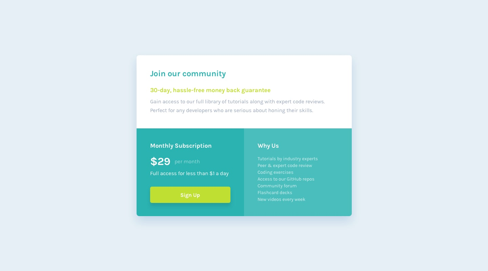

# Single price grid component

I created a Single Price Grid Component, featuring a modern-looking UI design responsive to all screen sizes. This project was developed as part of the [Frontend Mentor challenge](https://www.frontendmentor.io/challenges/single-price-grid-component-5ce41129d0ff452fec5abbbc). To achieve responsiveness, I utilized a grid layout combined with media queries.

## Table of contents

- [Overview](#overview)
  - [The challenges](#the-challenges)
  - [Screenshot](#screenshot)
  - [Links](#links)
- [My process](#my-process)
  - [Built with](#built-with)
  - [What I learned](#what-i-learned)
- [Author](#author)

## Overview

### The challenges

One of the challenges I encountered during this project was handling different images for desktop and mobile views. To address this, I implemented image selection with media queries.

### Screenshot

Desktop Design            |  Mobile Design 
:-------------------------:|:-------------------------:
  |  

### Links

- Solution URL: [GitHub Repository](https://github.com/Vi-r-us/Simple-Price-Grid-Component)
- Live Site URL: [Deployed on Github pages](https://vi-r-us.github.io/Simple-Price-Grid-Component/)

## My process

### Built with

- Semantic HTML5 markup
- CSS custom properties
- Flexbox
- CSS Grid
- Mobile-first workflow

### What I learned

This project allowed me to gain practical experience in front-end development, particularly in achieving responsive design using grid layout and media queries. Overcoming image challenges with media queries enhanced my skills in responsive web design.

## Author

- Github - [vi-r-us](https://github.com/Vi-r-us)
- Frontend Mentor - [@Vi-r-us](https://www.frontendmentor.io/profile/Vi-r-us)
